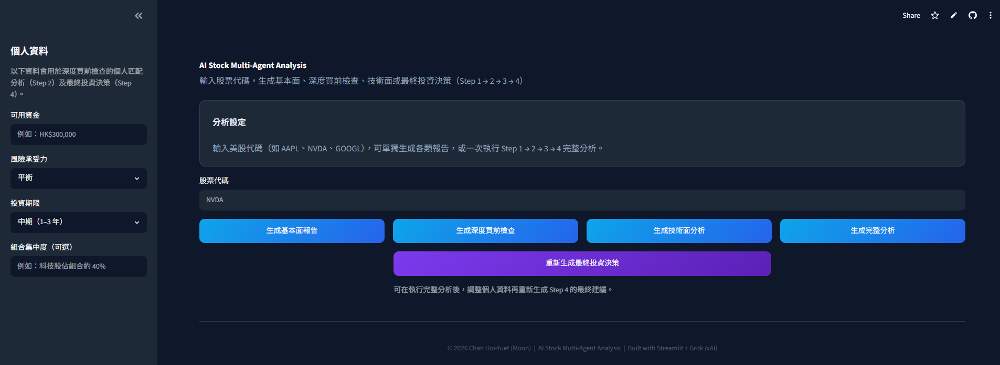
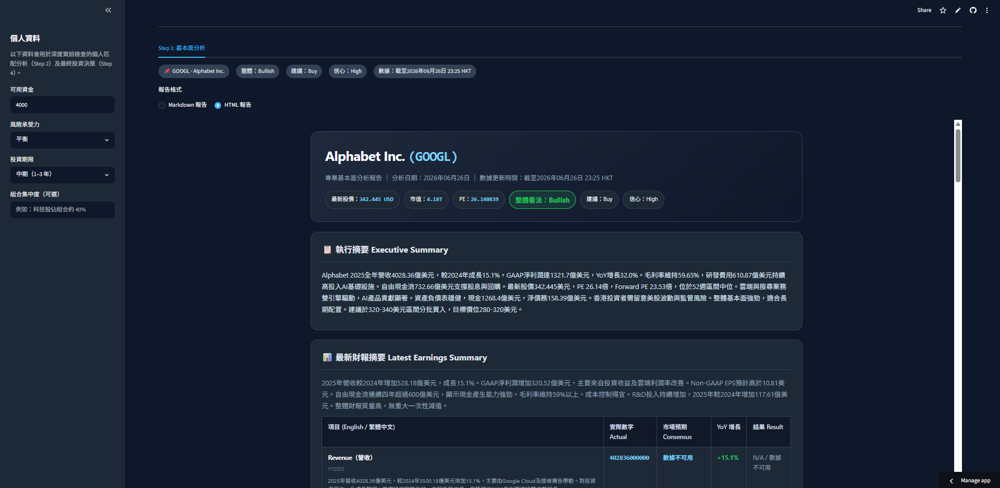
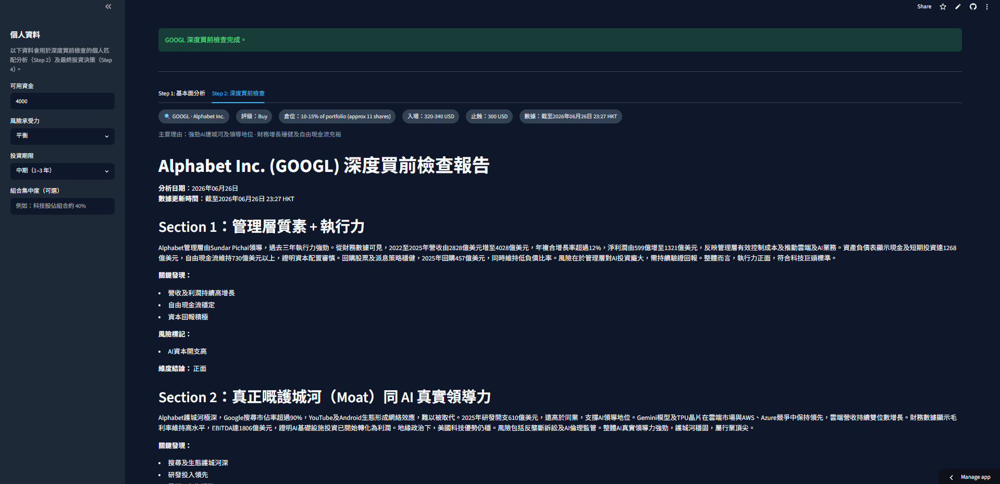
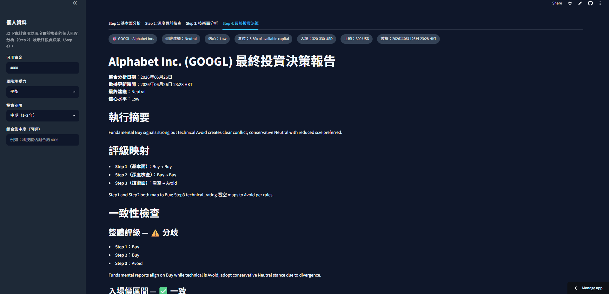

# AI Stock Multi-Agent Analysis System

**Live Demo:** [https://ai-stock-multi-agent-75d5nqefengwnuqvy94hpd.streamlit.app](https://ai-stock-multi-agent-75d5nqefengwnuqvy94hpd.streamlit.app)

A production-oriented multi-agent stock analysis system that performs comprehensive fundamental, pre-purchase due diligence, technical, and final investment decision analysis using Grok-4 (xAI).

---

## Project Overview

This project implements a **4-step sequential multi-agent workflow** designed to simulate how a professional investment team would evaluate a stock before making a decision.

Given a stock ticker and the user’s personal investment profile (available capital, risk tolerance, investment horizon), the system produces structured, actionable investment recommendations with position sizing and entry/exit strategies.

### Key Highlights
- 4 specialized agents working in sequence with clear separation of concerns
- Structured outputs enforced via Pydantic models (reliable, machine-readable reports)
- Real-time market data integration via yfinance + technical indicators
- Personal risk profile matching in the final recommendation
- Fully deployed public demo on Streamlit Community Cloud



---

## How the Multi-Agent Workflow Works

The system is deliberately designed with **modular agents** and **structured data flow**:

| Step | Agent | Responsibility | Key Output |
|------|-------|----------------|----------|
| **Step 1** | Fundamental Analysis | Financial statements, KPIs, business segments, guidance vs consensus | Structured financial report + overall view |
| **Step 2** | Pre-Purchase Deep Check | 8-dimension skeptical analysis (management quality, moat, macro/geopolitics, sentiment, valuation, black swans, personal fit) | Buy/Hold/Avoid rating + position sizing suggestion |
| **Step 3** | Technical Analysis | RSI, MACD, moving averages, support/resistance, chart patterns | Entry strategy + stop-loss / take-profit levels |
| **Step 4** | Final Investment Decision | Cross-report consistency check + personal profile matching | Final rating, recommended position size, entry/exit plan |

Each agent uses **Pydantic structured outputs** to ensure consistent, parseable results instead of free-text responses. This design improves reliability and makes future integration (e.g. into trading bots or dashboards) much easier.





---

## Features

- Real-time data fetching (yfinance)
- Technical indicators calculation (RSI, MACD, SMA)
- Personal investment profile input (capital, risk tolerance, horizon)
- Multi-step reasoning with consistency checking
- Professional dark-theme Streamlit interface
- Markdown + HTML report export
- Publicly deployed demo

---

## Tech Stack

- **LLM**: Grok-4 (xAI) via OpenAI-compatible API
- **Data & Indicators**: yfinance, pandas, ta
- **Structured Output**: Pydantic v2
- **Frontend**: Streamlit (dark theme)
- **Orchestration**: Custom sequential multi-agent workflow
- **Deployment**: Streamlit Community Cloud

---

## Project Structure

```text
ai-stock-multi-agent/
├── app.py                      # Entry point for Streamlit Cloud deployment
├── ui/
│   └── app.py                  # Main UI + workflow orchestration
├── agents/
│   ├── fundamental_agent.py    # Step 1: Fundamental Analysis
│   ├── deep_check_agent.py     # Step 2: Pre-Purchase Deep Check (8 dimensions)
│   ├── technical_agent.py      # Step 3: Technical Analysis
│   ├── final_decision_agent.py # Step 4: Final Investment Decision
│   └── models.py               # Pydantic models for all agents
├── tools/
│   ├── stock_data.py
│   └── technical_indicators.py
├── utils/
│   └── config.py               # API key & client configuration
├── requirements.txt
├── Dockerfile
└── .env.example
```
---

## Getting Started (Local)

git clone https://github.com/OceanMoon1031/ai-stock-multi-agent.git
cd ai-stock-multi-agent

pip install -r requirements.txt

#Create .env file with your Grok API key

echo "XAI_API_KEY=sk-your-key-here" > .env


streamlit run ui/app.py

---

## Author
Chan Hoi-Yuet (Moon)
BSc Computer Science, Hong Kong Metropolitan University

- **Interested in AI Engineering, LLM Applications, and Full-stack Development**:
- **Building production-oriented AI tools with focus on structured outputs, workflow design, and real-world usability**:

Links

- **GitHub: https://github.com/OceanMoon1031**:
- **Live Demo: https://ai-stock-multi-agent-75d5nqefengwnuqvy94hpd.streamlit.app**:

---

## License
This project is for portfolio and educational demonstration purposes.
